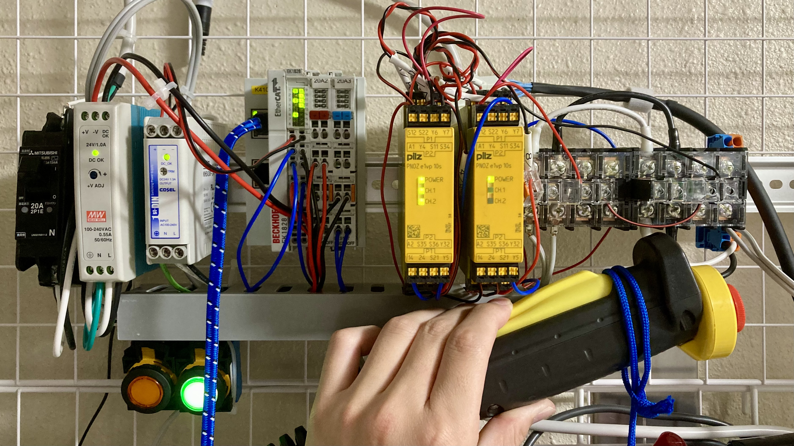
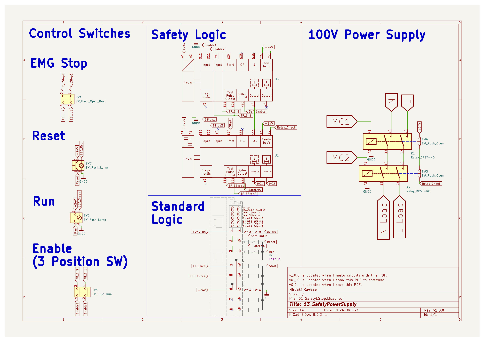

# SafetyPowerSupply
# 実験用電源遮断装置
## 外観

## 概要

このリポジトリは、ソフトウェア開発時における予想外の危険から実験機と実務担当者（特に新入社員や学生）を保護するための実験用電源遮断装置の設計およびドキュメントを提供します。本プロジェクトは、Beckhoff EtherCAT Terminal、Pillzセーフティコントローラ、OMRONパワーリレー、IDECデッドマンスイッチ、非常用押しボタンを使用して、安全な実験環境を構築することを目的としています。

このリポジトリは、PLC用のOSSリポジトリである[OpenSchematicsForPLCs](https://github.com/zilmina/OpenSchematicsForPLCs.git)のサンプルとして機能します。また、このリポジトリは[OpenSchematicsForPLCs](https://github.com/zilmina/OpenSchematicsForPLCs.git)をサブリポジトリとして利用しています。

## 目的

- ソフトウェア開発時の予期しない危険から実験機と実務担当者を保護
- 致命傷や二次災害の防止
- 安全性と信頼性の向上を図る

## 背景

実験機を作成・操作する担当者は、知見が不足していることが多く、この状況で実機に向き合う必要があります。
最低限の安全（死なない、強制停止は動く）を確保することは使用者の責務ですが、予算や時間の制約から軽視されがちです。
いいかげん，どのようなリスクの上に技術が発展をしてきているのか自覚をするべきです。

## 主要コンポーネント

- **GMKtec ミニPC**
  - モデル: G3
  - 役割: TwinCATの実行
 
- **Beckhoff EtherCAT Terminal**
-   モデル：EK1828
-   役割: 通常SWの監視，セーフティコントローラのモニタリング再開指令の発行

- **Pillzセーフティコントローラ**
  - モデル: PNOZ e1vp 10s
  - 役割: デッドマンススイッチ，非常停止スイッチ，2重化したリレーを監視し、緊急時にはシステム全体を迅速に停止

- **OMRONパワーリレー**
  - モデル: G7Z-4A-02Z
  - 役割: 電源遮断

- **IDECデッドマンスイッチ**
  - モデル: HE1G-L20M
  - 役割: 継続的な安全確認を行うスイッチ
  - 補足: 感電や強い衝撃を受けた際に反射で握り込む習性を利用して非常事態を迅速に検知

- **IDEC非常用押しボタン**
  - モデル: HE1G-L20M
  - 役割: 緊急時に手動でシステムを停止

## 動作フロー

1. **TwinCATの起動**
   - Ready to Operation状態に入り、緑色のLEDが点灯します。

2. **起動操作**
   - デッドマンスイッチを握り込み，RUNボタンが押す。
   - 緑色のLEDが消灯し、赤色のLEDが点灯します。
   - 電源供給が開始されます。

3. **通常停止**
   - 赤色のボタンを押す。
   - 危険源の動作がおわっった段階でグリップを手放す．
   - 非常停止を押す．

4. **非常停止**
   - 非常停止スイッチを殴る．

5. **リセット**
   - リセットボタンが押されると、起動待機状態に戻ります。

## 回路図

## 免責事項

このプロジェクトを利用する際には、いかなる被害についても請求しないことをご理解いただき、必要に応じて安全性の向上を図るための提案者として貢献していただけることをお願いしています。私たちは、皆様のフィードバックと協力を大切にし、一緒にプロジェクトを改善していきたいと考えています。ぜひ、安心してご参加ください。

## コントリビューション

コントリビューションは歓迎します。以下の手順に従ってください：

1. フォークしてプルリクエストを送信してください。
2. コーディングスタイルガイドラインに従ってください。
3. すべての変更点をドキュメント化してください。

## ライセンス

このプロジェクトはMITライセンスの下で提供されています。詳細はLICENSEファイルを参照してください。

## お問い合わせ

質問やフィードバックがある場合は、リポジトリのIssueセクションを通じて連絡してください。
